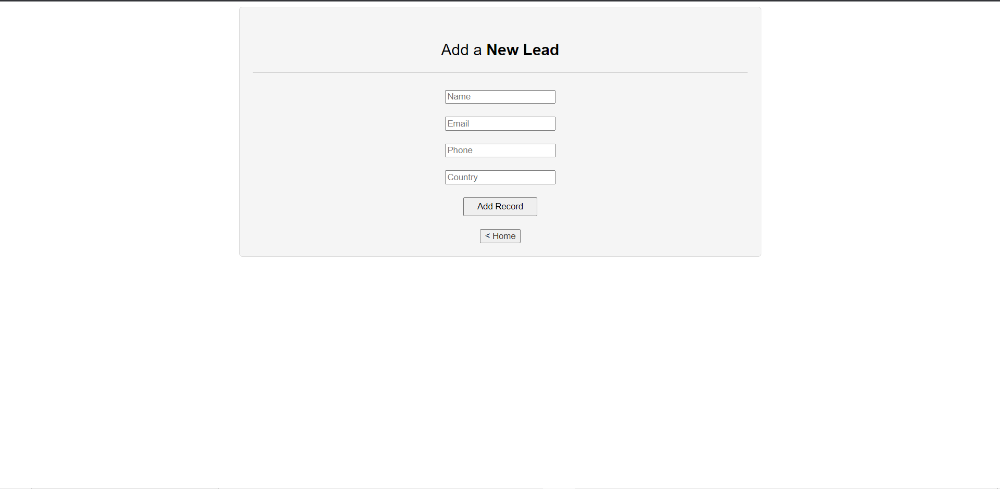
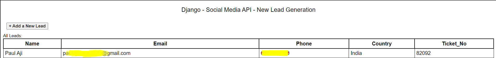
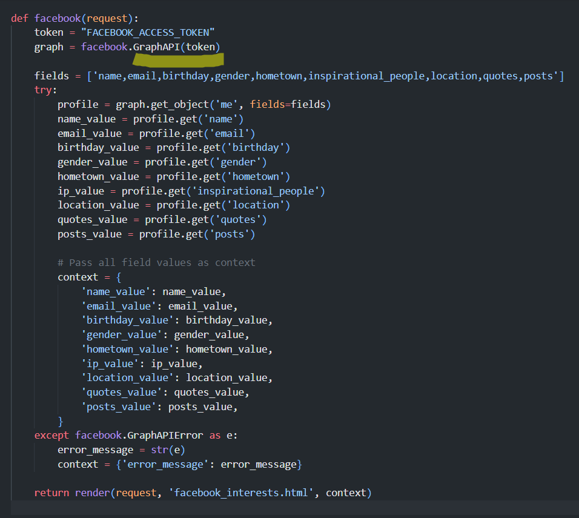

# django-socialinterests

## Overview

"Django-socialinterests" is a component of the larger project designed for New Lead Registration with Token Generation. It is integrated with social media APIs, including Facebook Graph API. This component aims to provide new lead registration functionality with token generation.



## Features

- New lead registration with ticket generation.
- Integration with social media APIs for enhanced functionality.



## Installation

To set up and run this component, follow these steps:

1. Clone the Repository:
   ```bash
   git clone [repository-url]

## Issues Faced

While connecting with the Facebook Graph API, the project encountered recognition issues. This section highlights the challenges faced during the development process.


